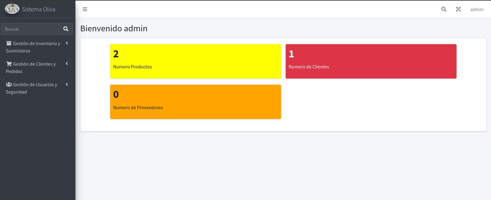

# Sistema de Ventas

## Introducción y objetivos

El sistema de ventas es una aplicación web diseñada para gestionar la venta de productos en pequeñas y medianas empresas. La aplicación facilita la gestión de clientes, productos y proveedores. También permite la creación de usuarios, roles y permisos

## Imagenes del sistema

### Página de inicio

### Página de ecommerce

### 🚀 Modulos

#### Funcionales

-   Gestionar ABM de clientes
-   Gestionar ABM productos
-   Generacion de SKU - Stock keep Unit
-   Gestionar ABM proveedores
-   Gestionar Pedidos 
-   Gestion de pagos a traves de Mercado pago  

#### No funcionales

-   Creacion y asignacion de roles
-   Gestionar usuarios

## Tecnologias utilizadas

### Analisis y diseño

-   Programacion orientada a objetos
-   Modelo Vista Controlador
-   Patrones de diseño: Strategy Patron. El patron facilita la creacion de formatos de SKU.

### Frontend

-   Laravel Blade
-   HTML, CSS y JavaScript valina
-   Bootstrap 5
-   AdminLTE 3

### Backend

-   Laravel Framework 9
-   SQLite
-   PHP version 8.1

### Integraciones 

-   Mercado Pago - Checkout Pro

## 🛠️ Guía rápida para correr el proyecto

1. Clonar el repositorio
    > git clone https://github.com/exebrites/sistema-ventas.git
2. Crear un archivo .env dentro de directorio raiz con sus variables de entorno:
    > cp .env.example .env
3. Realice la conexion a base de datos en el archivo .env
    > DB_CONNECTION=sqlite
4. Ejecutar el siguiente comando para descargar las dependencias:
    > composer install
5. Ejecutar el siguiente comando para generar la clave necesaria para laravel

    > php artisan key:generate

6. Ejecuta el siguiente comando para que funcione la gestion de productos
    > php artisan storage:link
7. Ejecutar el siguiente comando para correr la aplicación:

    > php artisan serve

8. Ejecutar el siguiente comando para compilar y ejecutar los paquetes

    > - npm install
    > - npm run dev

9. Ingrese al sistema con el sigueinte usuario
   email:admin@gmail.com, password: admin

10. Modifique el archivo .env para el correcto funcionamiento con Mercado Pago. Utilice Ngrok para notificacion_url https://ngrok.com/
